# Netty框架

[toc]

## 高性能服务器

<u>高性能服务器的三个性能指标：</u>

- 业务指标：高并发用户
- 技术指标：

  - 高吞吐量（Throughout）
  - 低延迟（Latency）

<u>软件系统的三个标准：</u>

* 可靠性（Reliability）

  系统在 **困境**（adversity，比如硬件故障、软件故障、人为错误）中仍可正常工作（正确完成功能，并能达到期望的性能水准）。

* 可伸缩性（Scalability）

  有合理的办法应对系统的增长（数据量、流量、复杂性）。

* 可维护性（Maintainability）

  许多不同的人（工程师、运维）在不同的生命周期，都能高效地在系统上工作（使系统保持现有行为，并适应新的应用场景）。

### 如何描述负载？

> 负载可以用一些称为 **负载参数（load parameters）** 的数字来描述。参数的最佳选择取决于系统架构，它可能是每秒向 Web 服务器发出的请求、数据库中的读写比率、聊天室中同时活跃的用户数量、缓存命中率或其他东西。除此之外，也许平均情况对你很重要，也许你的瓶颈是少数极端场景。
>
> 《数据密集型系统应用设计》

### 如何描述性能？

> 对于 Hadoop 这样的批处理系统，通常关心的是 **吞吐量（throughput）**，即每秒可以处理的记录数量，或者在特定规模数据集上运行作业的总时间 [^iii]。对于在线系统，通常更重要的是服务的 **响应时间（response time）**，即客户端发送请求到接收响应之间的时间。
>
> 《数据密集型系统应用设计》

#### 吞吐量

吞吐量可以是: QPS（请求/s）、TPS（业务量/s）

#### 响应时间

<u>延迟（latency）vs 响应时间（response time）：</u>

延迟从系统的角度，某个请求等待处理的 **持续时长**，在此期间它处于 **休眠（latent）** 状态，并等待服务。

响应时间从客户端的角度，发起请求到收到响应的时间，中间包括了网络延迟和IO排队延迟。

#### 分布（distribution）

平均响应时间的意义不大，要用**高百分位点**。一般使用P99或P999，减小高百分位点处的响应时间相当困难，因为它很容易受到随机事件的影响，这超出了控制范围，而且效益也很小。

### 高性能带来的问题

- 系统复杂度高

- 建设和维护成本高

- 故障或BUG导致的破坏性高

<u>如何应对这些问题？</u>

对系统量化，做稳定性建设（混沌工程）：

1. 增加可伸缩性

   应对负载的方法是**纵向伸缩（增加性能）和横向伸缩（增加节点）**。需要考虑系统的特点选择不同的方案，例如用于处理每秒十万个请求（每个大小为 1 kB）的系统与用于处理每分钟 3 个请求（每个大小为 2GB）的系统看上去会非常不一样，尽管两个系统有同样的数据吞吐量。

   > 一个良好适配应用的可伸缩架构，是围绕着 **假设（assumption）** 建立的：哪些操作是常见的？哪些操作是罕见的？这就是所谓负载参数。

2. 控制爆炸半径

   把变动的影响范围控制在一定范围内。

3. 工程方面积累和改进

   做预防，预防天灾人祸；积累应对策略并改进。

## Netty概述

[Netty](https://netty.io/)是一个 `异步的`，`事件驱动`，`基于NIO`的**网络应用开发框架**。Netty把网络细节屏蔽，并提供很多参数针对不同业务场景。Netty提供了网络处理的统一编程模型：无论TCP/UDP，客户端/服务端，NIO/IO代码都差不多。

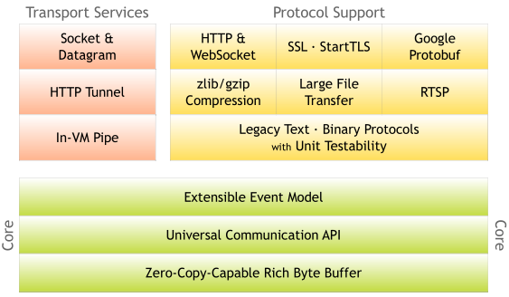

Netty 的特性：

- 高吞吐

- 低延迟

- 低开销

- 零拷贝

- 可扩容

- 松耦合

  不需要关系操作网络的代码，只写业务逻辑

- 容易使用

  可维护性高

### 基本概念

- `Channel`

  通道，Java NIO中的基础概念，代表一个打开的连接，可执行读取/写入IO操作。Netty对`Channel`的所有IO操作都是非阻塞的。

- `ChannelFuture`

  Java的`Future`接口，只能查询操作的完成情况，或者阻塞当前线程等待操作完成。Netty封装一个`ChannelFuture`接口。我们可以将回调方法传给`ChannelFuture`,在操作完成时自动执行。

- `Event` & `Handler`

  Netty基于事件驱动，事件和处理器可以关联到入站和出站数据流。

  入站事件有：

  - 通道激活和停用
  - 读操作事件
  - 异常事件
  - 用户事件

  出站事件有：

  - 打开连接
  - 关闭连接
  - 写入数据
  - 刷新数据

- `Encoder` & `Decoder`
  处理网络IO时，需要进行序列化和反序列化，转换Java对象与字节流。

  - 对入站数据进行解码,基类是`ByteToMessageDecoder`。
  - 对出站数据进行编码，基类是`MessageToByteEncoder`。

- `ChannelPipeline`

  数据处理管道就是事件处理器链。有顺序、同一Channel的出站处理器和入站处理器在同一个列表中。


## Netty原理

### Reactor模型

Reactor模型是事件驱动的，有一个或多个并发输入源，有**一个`ServiceHandler`**和**多个`EventHandlers`**。

`ServiceHandler`会**同步**地将输入的请求**多路复用地分发**给相应的`EventHandler`。即请求的分发和处理是分开的。

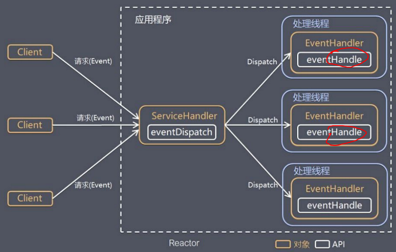

#### Reactor的三种模式

##### 单线程模式

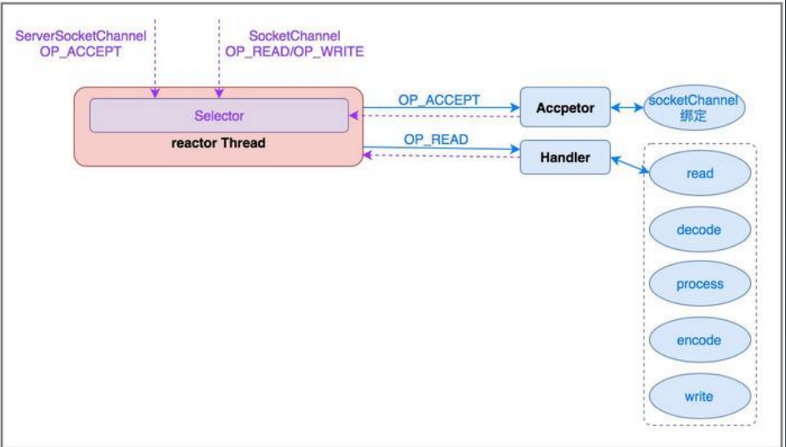

##### 多线程模式

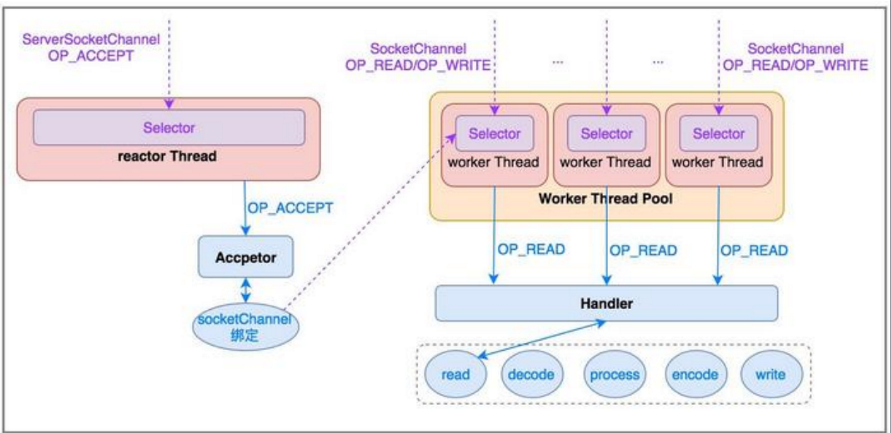

##### 主从模式

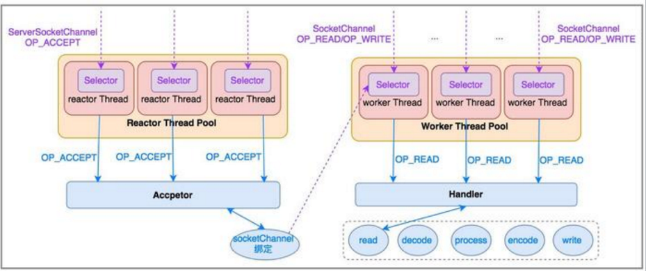

#### Netty对三种Reactor模式的支持

单线程模式：

```java
EventLoopGroup eventGroup = new NioEventLoopGroup(1);

ServerBootstrap serverBootstrap = new ServerBootstrap();
serverBootstrap.group(eventGroup);
```

多线程模式：

```java
EventLoopGroup eventGroup = new NioEventLoopGroup();

ServerBootstrap serverBootstrap = new ServerBootstrap();
serverBootstrap.group(eventGroup);
```

主从模式：

```java
EventLoopGroup bossGroup = new NioEventLoopGroup();
EventLoopGroup workerGroup = new NioEventLoopGroup();

ServerBootstrap serverBootstrap = new ServerBootstrap();
serverBootstrap.group(bossGroup, workerGroup);
```

#### Netty的启动和处理流程

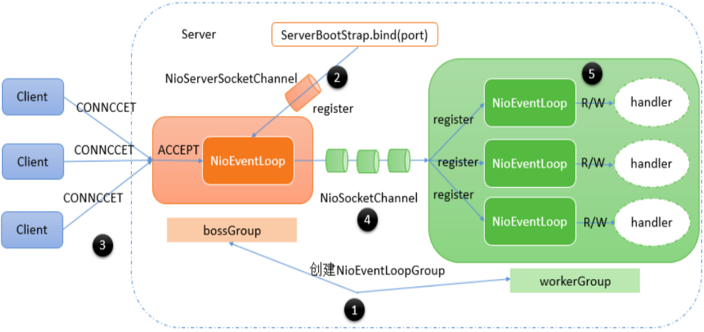

#### Netty线程模式

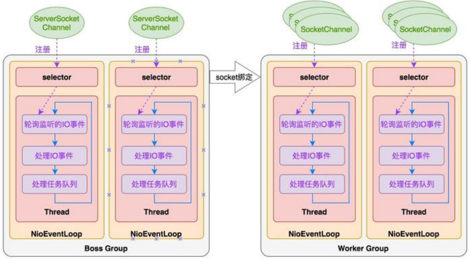

#### EventLoop

在Netty中，每个`EventLoopGroup`中包含多个`EventLoop`，每个`EventLoop`相当于reactor的`serviceHandler`，持有单个线程和Selector对象，响应IO事件并分发给`eventHandler`处理。

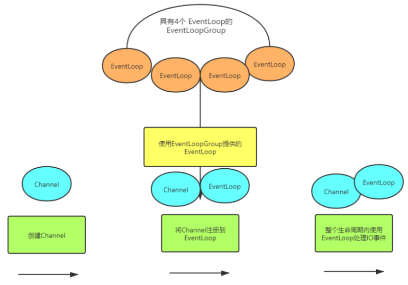

### 运行原理

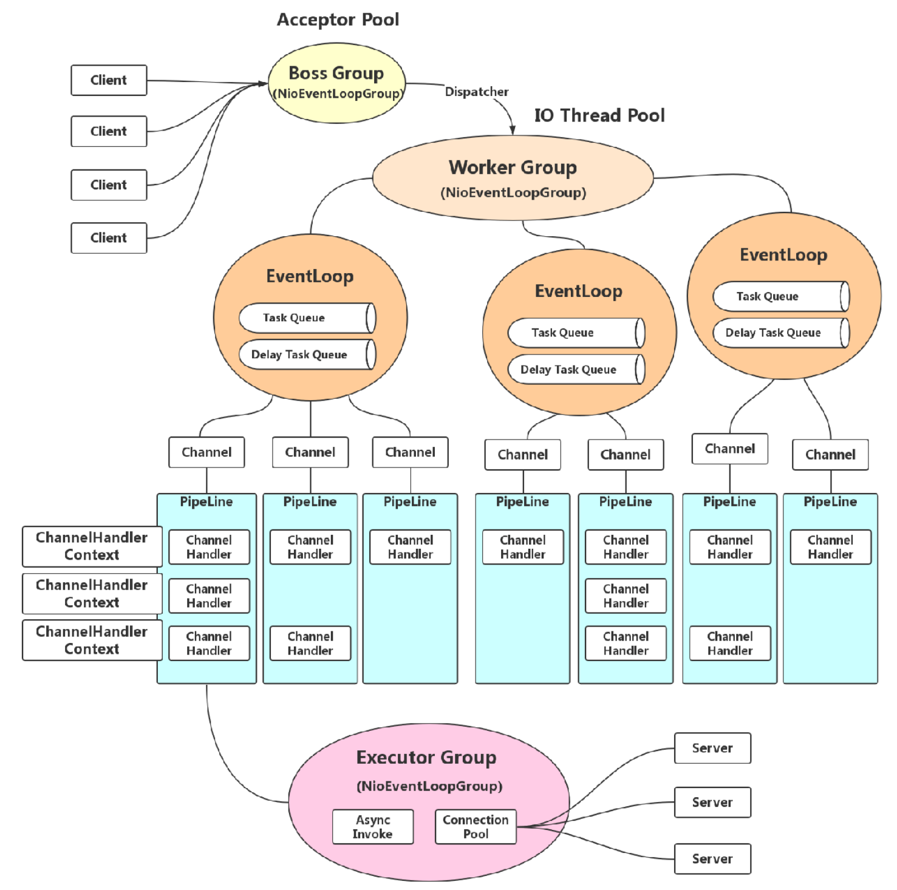

## Netty网络程序优化

netty已经提供了一系列实现或参数供选择，适当的配置可优化网络应用。

### 粘包和拆包

面向连接的协议(`TCP`)才有的问题，但不是`TCP`的问题，而是**代码问题：没规定好分包协议**。

产生原因：

- 操作系统的缓冲区
- 发送方和接收方速度差异

本质原因：没有规范二进制流的边界。

#### Netty如何解决粘包和半包问题？

Netty的`ByteToMessageDecoder`提供了一些实现类：

1. `FixedLengthFrameDecoder`

   定长协议解码器，我们可以指定固定的字节数算一个完整的报文

2. `LineBasedFrameDecoder`

   行分隔符解码器，遇到`\n` 或者`\r\n`，则认为是一个完整的报文

3. `DelimiterBasedFrameDecoder`

   分隔符解码器，分隔符可以自己指定。

   Note: ASCII码0-128是可显示字符，129-255是不可见的，可以用来当分隔符。

4. `LengthFieldBasedFrameDecoder`

   可变长度编码解码器，将报文划分为报文头/报文体。

   http的chunk机制和断点续传也是类似的机制。

5. `JsonObjectDecoder`

   json 格式解码器，当检测到匹配数量的`{` 、`}`或`[`、`]`时，则认为是一个完整的 json 对象或者 json 数组。

### Nagle和TCP_NODELAY

#### Nagle算法

为了尽可能发送大块数据，避免网络中充斥着许多小数据块，造成网络拥堵。


MTU: 最大传输单元，默认1500Byte

MSS: 最大分段大小，默认1460Byte（前面需要放置IP头和TCP头，各占20Byte）

#### Netty的优化

Netty提供TCP_NODELAY参数关闭Nagle。

关闭Nagle后并发高的时候效果更好，或者数据包太大，如1.6K，必须分包的时候需要关闭

优化条件：

- 缓冲区满
- 达到超时

### 连接优化

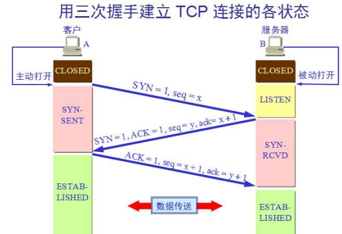


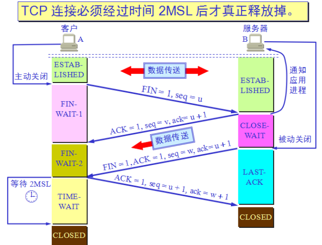

MSL： linux2分钟，win1分钟

客户端会等待2个周期，一直占用端口

//socket会占用FD

### Netty优化

#### 不要阻塞EventLoop

EventLoop是单线程，不要有阻塞操作，如使用独占锁导致其他线程阻塞。

#### 系统参数优化

更改操作系统socket fd的限制：

```bash
ulimit -a 
/proc/sys/net/ipv4/tcp_fin_timeout 
TcpTimedWaitDelay
```

#### 缓冲区优化

SO_RCVBUF

SO_SNDBUF

SO_BACKLOG：已连接和正在连接的数量

REUSEXXX

#### 心跳周期优化

心跳机制与短线重连

#### 内存与 ByteBuffer 优化

DirectBuffer与HeapBuffer

#### 其他优化

- ioRatio： IO和非IO的比例，一般50:50

- Watermark： 高低水位的一些机制

- TrafficShaping： 限流

## API网关

网关的职能：

1. 请求接入

   作为所有API接口请求的接入点。

2. 业务聚合

   作为所有后端业务的聚合点。

3. 中介策略

   实现安全、验证、路由、过滤、流控等策略。

4. 统一管理

   对所有API服务和策略进行统一管理。

### 网关的分类

网关分为流量网关和业务网关。

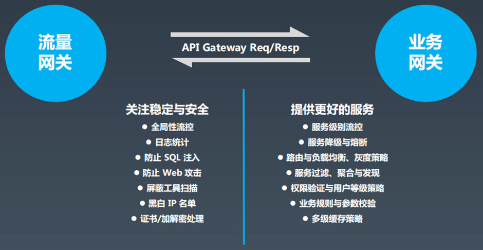

#### 流量网关

例如Nginx、OpenResty，适合做全局性的流控，日志，安全等。一般性能都非常好。

#### 业务网关

例如Zuul、SpringCloudGateway，把业务相关的策略放进入，如鉴权等。在于拓展性，适合用户二次开发。

### 网关组件

#### Zuul

基于BIO

#### Zuul2

基于Netty实现，


#### Spring Cloud Gateway

概念参考的Zuul，底层基于WebFlux。


