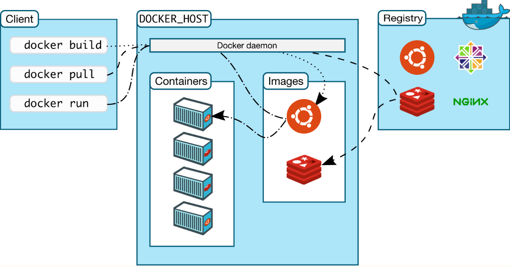
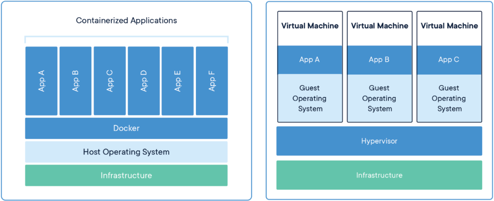
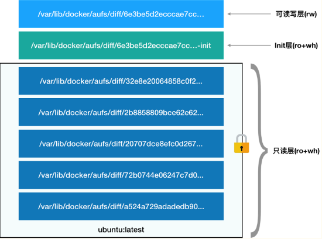

# Docker

[toc]

## Docker基础知识

### Docker概述

**容器是一个标准的软件单元，它打包了代码及其所有依赖项，因此应用程序可以从一个计算环境快速可靠地运行到另一个计算环境**。 Docker 容器映像是一个轻量级、独立、可执行的软件包，其中包含运行应用程序所需的一切：代码、运行时、系统工具、系统库和设置。Docker 是一个用于开发、交付和运行应用程序的开放平台。 **Docker 使您能够将应用程序与基础设施分开，以便您可以快速交付软件**。

容器其实是一种**沙盒技术**。顾名思义，沙盒就是能够像一个集装箱一样，把你的应用“装”起来的技术。这样，**应用与应用之间，就因为有了边界而不至于相互干扰**；而被装进集装箱的应用，也可以**被方便地搬来搬去**。

Docker镜像解决了传统PaaS平台**应用打包的痛点**。

### Docker架构



### 容器和虚拟机的比较

容器和虚拟机具有相似的**资源隔离和分配优势**，但功能不同，因为容器虚拟的是操作系统而不是硬件。容器更便携，更高效。

**虚拟机 (VM)** 是将一台服务器变成多台服务器的**物理硬件的抽象**。管理程序允许多个 VM 在一台机器上运行。每个 VM 都包含操作系统、应用程序、必要的二进制文件和库的完整副本 - 占用数十 GB。 VM 的启动速度也可能很慢。

**容器**是**应用层的抽象**，将代码和依赖项打包在一起。**==多个容器可以在同一台机器上运行，并与其他容器共享操作系统内核，每个容器作为用户空间中的独立进程运行。==**容器占用的空间比 VM 少（容器镜像的大小通常为数十MB），可以处理更多应用程序，并且需要更少的 VM 和操作系统。

当然，容器也有自身的缺陷：**隔离不彻底**。因为是多个容器共享宿主机内核，<u>所有在 Windows 宿主机上运行 Linux 容器，或者在低版本的 Linux 宿主机上运行高版本的 Linux 容器，都是行不通的</u>。另外，假如一个容器需要修改系统内核的配置，也可能影响其他容器的使用。



### Docker如何实现资源的隔离和限制？

**跟真实存在的虚拟机不同，在使用 Docker 的时候，并没有一个真正的“Docker 容器”运行在宿主机里面**。Docker 项目帮助用户启动的，还是原来的**应用进程**，只不过在创建这些进程时，Docker 为它们加上了各种限制。容器技术的核心功能，就是通过约束和修改进程的动态表现，从而为其创造出一个“**边界**”。对于 Docker 等大多数 Linux 容器来说，==**Cgroups** 技术是用来制造约束的主要手段，而 **Namespace** 技术则是用来修改进程视图的主要方法。==


#### 使用Linux namespace隔离资源

Linux Namespace是Linux提供的一种**内核级别环境隔离**的方法，Linux提供了对UTS、IPC、mount、PID、network、User等的隔离机制，用来对各种不同的进程上下文进行“障眼法”操作。它其实只是 **Linux 创建新进程的一个可选参数**。

以pid namespace为例，在 Linux 系统中创建线程并隔离pid：

```c
int pid = clone(main_function, stack_size, CLONE_NEWPID | SIGCHLD, NULL);
```

这时，这些进程就会觉得自己是各自 PID Namespace 里的**第 1 号进程**，只能看到各自 Mount Namespace 里挂载的目录和文件，只能访问到各自 Network Namespace 里的网络设备，就仿佛运行在一个个“容器”里面，与世隔绝。当然，这只是“障眼法”，在宿主机的进程空间里，它的pid还是真实的数值。

#### 使用Linux cgroups限制资源

Linux Cgroups(Linux Control Group)是 Linux 内核中用来**为进程设置资源限制**的一个重要功能，它最主要的作用，就是限制一个进程组能够使用的资源上限，包括 CPU、内存、磁盘、网络带宽等等。**cgroups给用户暴露的操作接口是文件系统，在`/sys/fs/cgroup`目录下**:
```shell
root@k8s-node-2:~# ls -l /sys/fs/cgroup/
total 0
dr-xr-xr-x 6 root root  0 Dec 19 10:07 blkio
lrwxrwxrwx 1 root root 11 Dec 19 10:07 cpu -> cpu,cpuacct
lrwxrwxrwx 1 root root 11 Dec 19 10:07 cpuacct -> cpu,cpuacct
dr-xr-xr-x 6 root root  0 Dec 19 10:07 cpu,cpuacct
dr-xr-xr-x 4 root root  0 Dec 19 10:07 cpuset
dr-xr-xr-x 6 root root  0 Dec 19 10:07 devices
dr-xr-xr-x 4 root root  0 Dec 19 10:07 freezer
dr-xr-xr-x 4 root root  0 Dec 19 10:07 hugetlb
dr-xr-xr-x 6 root root  0 Dec 19 10:07 memory
dr-xr-xr-x 2 root root  0 Dec 19 10:07 misc
lrwxrwxrwx 1 root root 16 Dec 19 10:07 net_cls -> net_cls,net_prio
dr-xr-xr-x 4 root root  0 Dec 19 10:07 net_cls,net_prio
lrwxrwxrwx 1 root root 16 Dec 19 10:07 net_prio -> net_cls,net_prio
dr-xr-xr-x 4 root root  0 Dec 19 10:07 perf_event
dr-xr-xr-x 6 root root  0 Dec 19 10:07 pids
dr-xr-xr-x 4 root root  0 Dec 19 10:07 rdma
dr-xr-xr-x 6 root root  0 Dec 19 10:07 systemd
dr-xr-xr-x 6 root root  0 Dec 19 10:07 unified

```

其中每个子目录称为**子系统**，分别用来限制对应的硬件资源。（Cgroup基于Linux文件系统来实现）

我们可以在对应的子系统下创建一个目录，表示一个**控制组**，系统会为我们自动创建资源组下的子系统。

假设我们想限制某进程的CPU只能使用20%，我们可以创建一个**控制组**，并在**`cpu.cfs_quota_us`**文件中写入`20000`(us)，**`cpu.cfs_period_us`**默认是100000，这两个数值表示为：**该控制组每100msCPU时间可以使用20ms**。接着，我们只要把进程的pid写入**tasks文件**下就可以实现资源限制的效果了。

我们通过api给每个容器限制的资源也会以一个容器ID为名的目录出现在控制组下：

```shell
root@k8s-node-3:~# ll /sys/fs/cgroup/cpu/docker/019998ff74d88298a91374020371dbc1b2f33f53e03ea9215a1dbfb2358dbb18/
total 0
drwxr-xr-x  2 root root 0 Dec 23 09:37 ./
drwxr-xr-x 24 root root 0 Dec 23 09:37 ../
-rw-r--r--  1 root root 0 Jan  3 08:37 cgroup.clone_children
-rw-r--r--  1 root root 0 Jan  3 08:37 cgroup.procs
-r--r--r--  1 root root 0 Jan  3 08:37 cpuacct.stat
-rw-r--r--  1 root root 0 Jan  3 08:37 cpuacct.usage
-r--r--r--  1 root root 0 Jan  3 08:37 cpuacct.usage_all
-r--r--r--  1 root root 0 Jan  3 08:37 cpuacct.usage_percpu
-r--r--r--  1 root root 0 Jan  3 08:37 cpuacct.usage_percpu_sys
-r--r--r--  1 root root 0 Jan  3 08:37 cpuacct.usage_percpu_user
-r--r--r--  1 root root 0 Jan  3 08:37 cpuacct.usage_sys
-r--r--r--  1 root root 0 Jan  3 08:37 cpuacct.usage_user
-rw-r--r--  1 root root 0 Jan  3 01:19 cpu.cfs_period_us
-rw-r--r--  1 root root 0 Jan  3 01:19 cpu.cfs_quota_us
-rw-r--r--  1 root root 0 Jan  3 01:19 cpu.shares
-r--r--r--  1 root root 0 Jan  3 08:37 cpu.stat
-rw-r--r--  1 root root 0 Jan  3 08:37 cpu.uclamp.max
-rw-r--r--  1 root root 0 Jan  3 08:37 cpu.uclamp.min
-rw-r--r--  1 root root 0 Jan  3 08:37 notify_on_release
-rw-r--r--  1 root root 0 Jan  3 08:37 tasks
root@k8s-node-3:~# cat /sys/fs/cgroup/cpu/docker/019998ff74d88298a91374020371dbc1b2f33f53e03ea9215a1dbfb2358dbb18/cpu.cfs_period_us
100000
root@k8s-node-3:~# cat /sys/fs/cgroup/cpu/docker/019998ff74d88298a91374020371dbc1b2f33f53e03ea9215a1dbfb2358dbb18/cpu.cfs_quota_us
-1

```


##### 有了namespace的隔离，为什么还需要对容器做“限制”呢？

虽然容器内的第 1 号进程在“障眼法”的干扰下只能看到容器里的情况，但是宿主机上，**它作为第 100 号进程与其他所有进程之间依然是平等的竞争关系**。

这就意味着，虽然第 100 号进程表面上被隔离了起来，但是它所能够使用到的资源（比如 CPU、内存），却是可以随时被宿主机上的其他进程（或者其他容器）占用的。当然，这个 100 号进程自己也可能把所有资源吃光。这些情况，显然都不是一个“沙盒”应该表现出来的合理行为。


##### Cgroups对资源限制的不足

例如：**/proc***文件系统。众所周知，**Linux 下的 /proc 目录存储的是记录当前内核运行状态的一系列特殊文件，用户可以通过访问这些文件，查看系统以及当前正在运行的进程的信息，比如 CPU 使用情况、内存占用率等，这些文件也是 top 指令查看系统信息的主要数据来源。** 

但是，你如果在容器里执行 top 指令，就会发现，它显示的信息居然是宿主机的 CPU 和内存数据，而不是当前容器的数据。**造成这个问题的原因就是，/proc 文件系统并不知道用户通过 Cgroups 给这个容器做了什么样的资源限制，即：/proc 文件系统不了解 Cgroups 限制的存在。**

在生产环境中，这个问题必须进行修正，**否则应用程序在容器里读取到的 CPU 核数、可用内存等信息都是宿主机上的数据**，这会给应用的运行带来非常大的困惑和风险。


#### Docker的文件系统

```shell
root@k8s-node-3:~# docker run -it ubuntu ls /
bin   dev  home  lib32  libx32  mnt  proc  run   srv  tmp  var
boot  etc  lib   lib64  media   opt  root  sbin  sys  usr

```

运行上述命令可以发现，**容器中看到的是一个完整的ubuntu的文件系统**，而且**容器里面是看不到外面的文件系统的**。这里其实用到了**Mount Namespace**，不过，只是单纯地在创建线程时使用参数是不会生效的，容器里看到的还会是宿主机的文件系统：

```c
clone(container_main, container_stack+STACK_SIZE, **CLONE_NEWNS** | SIGCHLD , NULL);
```

<u>这就是 Mount Namespace 跟其他 Namespace 的使用略有不同的地方：</u>**它对容器进程视图的改变，一定是伴随着挂载操作（mount）才能生效**，且这个挂载对宿主机不可见。所以，如果想让容器里看到的是一个独立的文件系统，需要可以在容器进程启动前，重新挂载它的根目录/。

**Linux中的`chroot`命令就是用来改变进程的根目录到指定位置的**。


##### Rootfs

如上面的ubuntu镜像根目录，为了让容器中的根目录看起来更真实，一般会给根目录挂载一个完整操作系统的文件系统。而这个挂载在容器根目录上、用来为容器进程提供隔离后执行环境的文件系统，就是所谓的“**容器镜像**”。它还有一个更为专业的名字，叫作：**rootfs（根文件系统）**。

**rootfs** 只是一个操作系统所包含的文件、配置和目录，**并不包括操作系统内核**。在 Linux 操作系统中，这两部分是分开存放的，操作系统只有在开机启动时才会加载指定版本的内核镜像。正是由于 rootfs 的存在，容器才有了一个被反复宣传至今的重要特性：**一致性**。


##### Docker的分层镜像

不过这里还有一个问题就是，软件是会不断更新的，每次更新就要从头制作一个镜像，而且这个新版本的镜像跟老版本没有一点联系，即使他们的大部分依赖环境都是相同的。所以Docker的镜像使用了**分层**的做法，结合**aufs**（联合文件系统）（新版Docker使用**overlay2**），实现了**增量更新**。镜像实际上是一个个的层，在使用的时候通过联合挂载到一个统一的挂载点上，作为容器的只读层。



容器的rootfs由三部分组成：

1. 只读层：镜像层。
2. Init 层： Docker 项目单独生成的一个内部层，专门用来存放 /etc/hosts、/etc/resolv.conf 等信息。这是**因为这里面存放的信息经常是根据用户指定设置的，所以放在镜像层上面覆盖**。
3. 可读写层：容器层，用户可以在这一层做修改，覆盖下层的文件，如果是删除文件，aufs会在可读写层创建一个whiteout文件来覆盖原文件，使其变得“不可见”。

#### 小结

**Docker容器的本质是一个进程**。

对Docker 项目来说，它最核心的原理实际上就是为**待创建的用户进程**：

1. 启用 Linux Namespace 配置；
2. 设置指定的 Cgroups 参数；
3. 切换进程的根目录（Change Root）。


## Docker使用

### docker run

官网参考：https://docs.docker.com/engine/reference/commandline/cli/

语法：

```shell
docker run [OPTIONS] IMAGE[:TAG|@DIGEST] [COMMAND] [ARG...]
```

#### 运行模式

##### Detached模式

```shell
docker run -d CONTAINER_NAME IMAGE COMMAND 
```

Detached模式（`-d`）会在**执行COMMAND的根进程**执行完后**退出容器**，所以需要配合阻塞的命令，例如Nginx的启动方式：

```shell
#正确的启动
$ docker run -d -p 80:80 my_image nginx -g 'daemon off;'
#错误的启动
$ docker run -d -p 80:80 my_image service nginx start
```

第二种启动方式在根进程（`service nginx start`）返回后停止容器。

可以使用`docker attach`重新连接到容器。

##### Foreground模型（默认）

`-a`：attach，用于连接`STDIN`, `STDOUT` 和/或 `STDERR`

`-t`：启动一个伪tty终端

`-i`：保持`STDIN`打开

`--sig-proxy=true`：当不是tty模式时，进程接收所有信号

```shell
docker run -a stdin -a stdout -it ubuntu /bin/bash
```

##### 运行完就退出

`--rm`

#### 容器名

`--name=MY_NAME`

#### PID设置

默认情况下，所有容器都启用了 PID 命名空间。PID 命名空间提供进程分离。PID 命名空间删除了系统进程的视图，并允许重用进程 ID，包括 pid 1。

如果希望容器共享主机的进程命名空间，基本上允许容器内的进程查看系统上的所有进程，可以使用`--pid=host`；

如果想调试另一个容器，可以使用`--pid=container:target-container`，例如用别的工具调试redis：

```shell
 docker run --name my-redis -d redis
 docker run -it --pid=container:my-redis my_strace_docker_image bash
 strace -p 1
```

#### 网络

```shell
--dns=[]           : Set custom dns servers for the container
--network="bridge" : Connect a container to a network
                      'bridge': create a network stack on the default Docker bridge
                      'none': no networking
                      'container:<name|id>': reuse another container's network stack
                      'host': use the Docker host network stack
                      '<network-name>|<network-id>': connect to a user-defined network
--network-alias=[] : Add network-scoped alias for the container
--add-host=""      : Add a line to /etc/hosts (host:IP)
--mac-address=""   : Sets the container's Ethernet device's MAC address
--ip=""            : Sets the container's Ethernet device's IPv4 address
--ip6=""           : Sets the container's Ethernet device's IPv6 address
--link-local-ip=[] : Sets one or more container's Ethernet device's link local IPv4/IPv6 addresses
```

##### 网络模式

| Network                  | Description                                                  |
| :----------------------- | :----------------------------------------------------------- |
| **none**                 | No networking in the container.                              |
| **bridge** (default)     | Connect the container to the bridge via veth interfaces.     |
| **host**                 | Use the host's network stack inside the container.           |
| **container**:<name\|id> | Use the network stack of another container, specified via its *name* or *id*. |
| **NETWORK**              | Connects the container to a user created network (using `docker network create` command) |

#### 重启策略

`--restart=`

| Policy                       | Result                                                       |
| :--------------------------- | :----------------------------------------------------------- |
| **no**                       | Do not automatically restart the container when it exits. This is the default. |
| **on-failure**[:max-retries] | Restart only if the container exits with a non-zero exit status. Optionally, limit the number of restart retries the Docker daemon attempts. |
| **always**                   | Always restart the container regardless of the exit status. When you specify always, the Docker daemon will try to restart the container indefinitely. The container will also always start on daemon startup, regardless of the current state of the container. |
| **unless-stopped**           | Always restart the container regardless of the exit status, including on daemon startup, except if the container was put into a stopped state before the Docker daemon was stopped. |

#### 限制资源

| Option              | Description                                                  |
| :------------------ | :----------------------------------------------------------- |
| `-m`, `--memory=""` | Memory limit (format: `<number>[<unit>]`). Number is a positive integer. Unit can be one of `b`, `k`, `m`, or `g`. Minimum is 4M. |
| `--cpus=0.000`      | Number of CPUs. Number is a fractional number. 0.000 means no limit. |

具体看: https://docs.docker.com/engine/reference/run/#runtime-constraints-on-resources

#### 卷

```shell
-v, --volume=[host-src:]container-dest[:<options>]: Bind mount a volume.
The comma-delimited `options` are [rw|ro], [z|Z],
[[r]shared|[r]slave|[r]private], and [nocopy].
The 'host-src' is an absolute path or a name value.

If neither 'rw' or 'ro' is specified then the volume is mounted in
read-write mode.

The `nocopy` mode is used to disable automatically copying the requested volume
path in the container to the volume storage location.
For named volumes, `copy` is the default mode. Copy modes are not supported
for bind-mounted volumes.

--volumes-from="": Mount all volumes from the given container(s)
```

#### Docker run例子

```shell
#mongodb
docker run --name mongodb -p 27017:27017 -v /home/colorlight/test/mongo/datadir:/data/db -d mongo

#dnsmasq
docker run \
--name dnsmasq \
-d \
-p 53:53/udp \
-p 5380:8080 \
-v /opt/dnsmasq/dnsmasq.conf:/etc/dnsmasq.conf \
--log-opt "max-size=100m" \
-e "HTTP_USER=admin" \
-e "HTTP_PASS=Colorlight1" \
--restart always \
jpillora/dnsmasq

#influxdb
docker run -d \
--name influxdb \
-p 8086:8086 \
-v influxdb_data:/var/lib/influxdb2 \
influxdb:alpine

#ffmpeg推流
docker run -v $(pwd):$(pwd) -w $(pwd) jrottenberg/ffmpeg \
-re -i b.mp4 -c copy -f flv rtmp://192.168.1.12:11935/screen/test

#rabbitmq
docker run -d --hostname my-rabbit -v $(pwd)/data:/var/lib/rabbit -p 5672:5672 -p 8181:15672 --name some-rabbit rabbitmq:3-management

#zipkin
docker run -d -p 9411:9411 -m 512M --name zipkin-server openzipkin/zipkin --zipkin.collector.rabbitmq.addresses=192.168.1.11:5672

#nacos
docker run --name nacos -e MODE=standalone -p 8848:8848 -d nacos/nacos-server:v2.1.2 --networks one-nw

#NEXUS
docker run -d  --restart=always \
--name nexus3 \
-p 8082:8081 \
-v nexus-data:/nexus-data \
-v /media/colorlight/sdb1/project_ccloud/nexus/storage:/sonatype-work/storage \
--network one-nw \
sonatype/nexus3
```

### docker build

```shell
docker build -t 镜像名 -f Dockerfile位置 指定构建的目录
```


### 离线镜像

保存：

```shell
docker save colorlightwzg/one-app:latest -o one-app.tar
docker save colorlightwzg/one-app:latest > one-app.tar
```

导出：

```shell
docker load colorlightwzg/one-app:latest -i one-app.tar
docker load colorlightwzg/one-app:latest < one-app.tar
```

