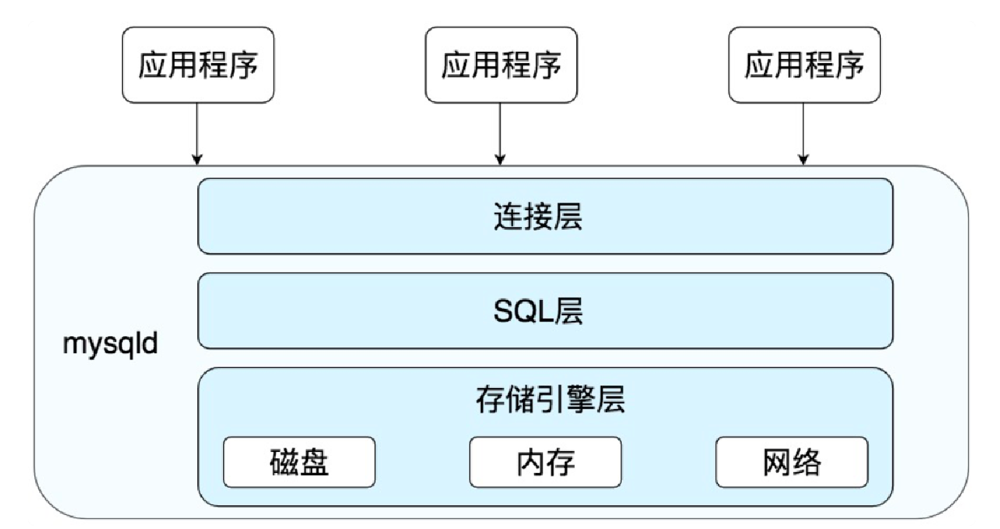

= database
:doctype: article
:toc:
:toclevels: 3
:sectnums:
:description: learn database
:appendix-caption: 附录
:figure-caption: 图
:icons: font

[abstract]
== 概述
=== 说明

=== 名词概念

OLTP:: 联机事务处理过程
OLAP:: 联机分析处理过程
RDBMS:: 对象关系型数据库管理系统
NoSQL:: 非关系型数据库
DDL:: Data Definition Language，也就是数据定义语言，它用来定义我们的数据库对象，包括数据库、数据表和列。通过使用 DDL，我们可以创建，删除和修改数据库和表结构。
DML:: Data Manipulation Language，数据操作语言，我们用它操作和数据库相关的记录，比如增加、删除、修改数据表中的记录。
DCL:: Data Control Language，数据控制语言，我们用它来定义访问权限和安全级别。
DQL::Data Query Language，数据查询语言，我们用它查询想要的记录，它是 SQL 语言的重中之重。在实际的业务中，我们绝大多数情况下都是在和查询打交道，因此学会编写正确且高效的查询语句，是学习的重点。

=== DBMS
==== 关系型数据库分类
===== Mysql

[title="mysql简单架构图"]

==== NoSQL分类
.Key-Value数据库
键值型数据库通过 Key-Value 键值的方式来存储数据，其中 Key 和 Value 可以是简单的对象，也可以是复杂的对象。Key 作为唯一的标识符，优点是查找速度快，在这方面明显优于关系型数据库，同时缺点也很明显，它无法像关系型数据库一样自由使用条件过滤（比如 WHERE），如果你不知道去哪里找数据，就要遍历所有的键，这就会消耗大量的计算。键值型数据库典型的使用场景是作为内容缓存。Redis 是最流行的键值型数据库。

.文档型数据库
文档型数据库用来管理文档，在数据库中文档作为处理信息的基本单位，一个文档就相当于一条记录，MongoDB 是最流行的文档型数据库。

.搜索引擎
搜索引擎也是数据库检索中的重要应用，常见的全文搜索引擎有 Elasticsearch、Splunk 和 Solr。虽然关系型数据库采用了索引提升检索效率，但是针对全文索引效率却较低。搜索引擎的优势在于采用了全文搜索的技术，核心原理是“倒排索引”。

.列式数据库
列式数据库是相对于行式存储的数据库，Oracle、MySQL、SQL Server 等数据库都是采用的行式存储（Row-based），而列式数据库是将数据按照列存储到数据库中，这样做的好处是可以大量降低系统的 I/O，适合于分布式文件系统，不足在于功能相对有限。

.列式数据库降低I/O的原理
****
行式存储是把一行的数据都串起来进行存储，然后再存储下一行。 同样，*列式存储是把一列的数据都串起来进行存储，然后再存储下一列*。 这样做的好处，*就是相邻的数据的数据类型是一样的，因此也更容易压缩。压缩之后就自然降低了IO。*
****

.图数据库
图形数据库，利用了图这种数据结构存储了实体（对象）之间的关系。最典型的例子就是社交网络中人与人的关系，数据模型主要是以节点和边（关系）来实现，特点在于能高效地解决复杂的关系问题。

[#sql-base]
== SQL基础
[TIP]
.SQL的大小写
关键字大写; +
表名、表别名、字段名、字段别名等都小写

=== 语法
==== DDL
DDL包含 create，drop，alter，在执行 DDL 的时候，不需要 COMMIT，就可以完成执行任务。

.建表语句
[source,sql]
----
CREATE TABLE `test` (
  `id` int NOT NULL AUTO_INCREMENT,
  `col1` varchar(255) DEFAULT NULL,
  `col2` varchar(255) DEFAULT NULL,
  `col3` varchar(255) DEFAULT NULL,
  PRIMARY KEY (`id`),
  UNIQUE KEY `index1` (`col1`)
) ENGINE=InnoDB AUTO_INCREMENT=1 DEFAULT CHARSET=utf8mb4 COLLATE=utf8mb4_bin;
----

.修改表
[source,sql]
----
-- 新增字段
ALTER TABLE test ADD (age int(10));
-- 修改字段类型
ALTER TABLE test MODIFY age int(8) DEFAULT 0 COMMENT `年龄`;
-- 修改字段名
ALTER TABLE test RENAME COLUMN age TO user_age;
ALTER TABLE test CHANGE age user_age int(8) DEFAULT 0 COMMENT `年龄`;
-- 删除字段
ALTER TABLE test DROP COLUMN age;
----

.删除表
[source,sql]
----
DROP TABLE test;
----

.清空表
[source,sql]
----
TRUNCATE TABLE test;
----

==== 查询语句
===== DISTINCT关键字
DISTINCT 需要放到所有列名的前面,**对后面所有列名的组合进行去重**。
[source,sql]
----
SELECT DISTINCT name, age <1>
FROM heros
----
<1> 会对name和age字段组合去重

===== ORDER BY关键字
可以排序多个字段，排序的字段每个都可以加DESC。
[source,sql]
----
SELECT
       name, hp_max
FROM heros
ORDER BY
         mp_max, <1>
         hp_max DESC <2>
----
<1> 先根据mp_max字段正序排序
<2> 再根据hp_max字段反序排序

===== LIMIT关键字
mysql中需要放在select的最后面
[source,sql]
----
SELECT * FROM test LIMIT 1, 10 <1>
SELECT * FROM test LIMIT 1 OFFSET 10
----
<1> 偏移10后取1行数据

===== SELECT后面可以用常量
[source,sql]
----
SELECT role_name,
       (select count(*) as count from (clt_role)),<1>
       "字符串", <2>
       12 <3>
from clt_role
----
<1> 将**WHERE子查询**的结果作为一列
<2> 直接将字符串常量作为列
<3> 直接将整数常量作为列

===== 查询语句的执行顺序

.sql关键字的顺序:
----
SELECT...FROM...WHERE...GROUP BY...HAVING...ORDER BY...LIMIT
----

.执行顺序：
----
FROM > WHERE > GROUP BY > HAVING > SELECT > DISTINCT > ORDER BY > LIMIT
----

查询语句的每一步都会生成``虚拟表``，然后将这个虚拟表**传入下一个步骤中作为输入**:

.查询语句的执行步骤
|===
|步骤 |产生的虚拟表 |说明

|FROM t1
|-
|-

|[left/right/inner/cross]JOIN t2
|Vt1-1
|进行笛卡尔积/添加外部行

|ON [条件]
|Vt1-2
|筛选符合条件的联表

|WHERE [filter]
|Vt2
|按条件过滤

|GROUP BY [*聚合函数 aggregate* <1>]
|Vt3
|按字段分组[如果有聚合函数，则执行]

|HAVING  [*表达式计算 predicate* <2>]
|Vt4
|分组过滤[如果有表达式,则执行]

|SELECT [DISTINCT]
|Vt5
|选择字段

|ORDER BY
|Vt6
|排序

|LIMIT
|Vt7
|限制结果集数量
|===
<1> 聚合函数: 例如SELECT后面的count(*), max(age),是以分组为单位计算的。
<2> HAVING的表达式

==== 关于 COUNT(*),COUNT(1),COUNT(id)的效率比较

.在MySQL InnoDB存储引擎中：
----
COUNT(*)和COUNT(1)都是对的所有结果进行的COUNT。如果有WHERE子句，则是对所有符合筛选条件的数据行进行统计。如果没有WHERE子句，则是对数据表的数据行数进行统计。

因此COUNT(*)和COUNT(1)本质上没有区别，执行的复杂度都是O(N)，也就是采用全表扫描，进行循环+计数的方式进行统计。
----

.MySQL MyISAM存储引擎：
----
统计数据表的行数只需要O(1)复杂度，这是因为每张MyISAM的数据表都有一个meta信息有存储了row_count值。
----

.原因：
InnoDB支持事务，#采用行级锁和MVCC机制#，所以无法像MyISAM一样，只维护一个row_count变量（#通过表级锁保证统计值的一致性#）。因此就需要采用扫描全表，进行循环+计数的方式来完成统计。

.InnoDB引擎中，如果是采用COUNT(*)和COUNT(1)来统计数据行数，要尽量采用二级索引:
原因: +
*主键采用的索引是聚簇索引，聚簇索引包含的信息多，明显会大于二级索引（非聚簇索引）。*

1. 对于查找具体的行来说，采用主键索引效率更高。
2. 而对于COUNT(*)和COUNT(1)这种，不需要查找具体的行，只是统计行数来说，系统会自动采用占用空间更小的二级索引来进行统计。 如果有多个二级索引的时候，会使用key_len小的二级索引进行扫描。当没有二级索引的时候，才会采用主键索引来进行统计。

.为什么在生产环境下，不推荐直接使用SELECT *进行查询？
减少数据表查询的网络传输量

===== 总结
1. 一般情况下：COUNT(星) = COUNT(1) > COUNT(字段) 所以尽量使用COUNT(星)，当然如果你要统计的是就是某个字段的非空数据行数，那另当别论。毕竟执行效率比较的前提是要结果一样才行。
2. *如果要统计COUNT(星)，尽量在数据表上建立二级索引，系统会自动采用key_len小的二级索引进行扫描*，这样当我们使用SELECT COUNT(星)的时候效率就会提升，有时候提升几倍甚至更高都是有可能的。

==== 表的约束
.*主键*
主键起的作用是**唯一标识一条记录，不能重复，不能为空，即 UNIQUE+NOT NULL**。一个数据表的主键只能有一个。主键可以是一个字段，也可以由多个字段复合组成。

.外键
外键确保了表与表之间引用的完整性。一个表中的外键对应另一张表的主键。外键可以是重复的，也可以为空。

.唯一索引
唯一性约束和普通索引（NORMAL  INDEX）之间是有区别的。唯一性约束相当于创建了一个约束和普通索引，目的是保证字段的正确性，而普通索引只是提升数据检索的速度，并不对字段的唯一性进行约束。

.其他字段约束
NOT NULL:: 非空
DEFAULT:: 指定默认值
CHECK:: 约束取值范围，如CHECK(height>=0 AND height<3)

=== SQL是如何执行的
Oracle 和 MySQL 都是通过``解析器``→``优化器``→``执行器``这样的流程来执行 SQL 的。

=== select语句的执行顺序

=== 数据过滤
=== sql函数
==== 内置函数
==== 聚合函数
=== 子查询
=== 连表

[#mysql-core]
== MySQL重要概念

[#inqin]
=== 存储引擎
.InnoDB
MySQL 5.5 版本之后默认的存储引擎，最大的特点是**支持事务、行级锁定、外键约束**等。

写的场景更优

.MyISAM
在 MySQL 5.5 版本之前是默认的存储引擎，*不支持事务*，也不支持外键，*只有表锁*，最大的特点是**速度快，占用资源少**。

适用场景为读写分离的读库

.Memory
使用系统内存作为存储介质，以便得到更快的响应速度。不过如果 mysqld 进程崩溃，则会导致所有的数据丢失，因此我们只有当数据是临时的情况下才使用 Memory 存储引擎。

.NDB
也叫做 NDB Cluster 存储引擎，主要用于 MySQL Cluster 分布式集群环境，类似于 Oracle 的 RAC 集群。

.Archive
它有很好的压缩机制，用于文件归档，在请求写入时会进行压缩，所以也经常用来做仓库。

[#transation]
=== 事务

[#lock]
=== 数据库锁
==== 锁
==== MVCC

[#index]
=== 索引
==== 概念
==== hash索引
==== b+数索引
===== 自适应hash

[#sql-optimization]

== 数据库优化
.好的SQL
一份好的 SQL 执行计划就会尽量减少 I/O 操作，因为 I/O 是 DBMS 最容易出现瓶颈的地方，可以说数据库操作中有大量的时间都花在了 I/O 上。

此外，你还需要考虑如何降低 CPU 的计算量，在 SQL 语句中使用 GROUP BY、ORDER BY 等这些语句会消耗大量的 CPU 计算资源，因此我们需要从全局出发，不仅需要考虑数据库的 I/O 性能，还需要考虑 CPU 计算、内存使用情况等。

=== sql优化思路
=== 表设计范式
==== 三范式
==== 反范式

=== 查询优化器

=== 性能问题分析和调优
[qanda]
Mysql中如何分析一条SQL的执行时间？::
+
--
.开启profiling
set profiling=1;   ：MySQL 收集在 SQL 执行时所使用的资源（时间）情况

.查看当前会话所产生的所有 profiles
show profiles;

.查看单个查询
show profile [for query 1];

DBMS的基本执行SQL流程
Oracle 和 MySQL 都是通过解析器→优化器→执行器这样的流程来执行 SQL 的。
--

[#db-advance]
== 进阶
[#jiagou]
=== 主从架构
==== 原理
==== 数据备份和恢复

[#fenpian]
=== 数据分片

[#fenbushi]
=== 分布式事务

[appendix]
== 问题列表

[appendix]
== 最佳实践

=== SQL书写规范

.SQL大小写问题
表名、表别名、字段名、字段别名等都小写；
SQL 保留字、函数名、绑定变量等都大写。

[bibliography]
== 链接